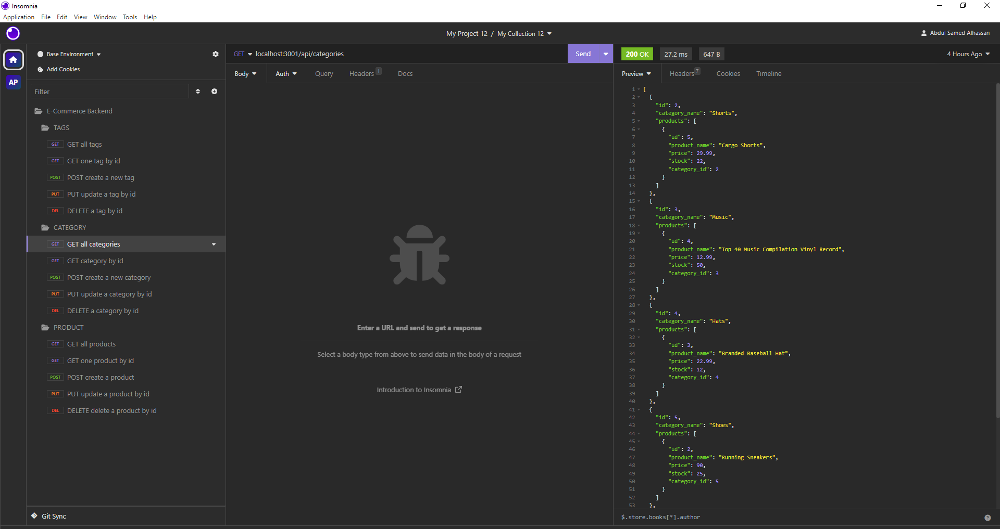

# E-Commerce Back End

## Table of Contents
  - [Overview](#overview)
  - [User Story](#user-story)
  - [Features](#features)
    - [Database Configuration](#database-configuration)
    - [Database Initialization](#database-initialization)
    - [Server Initialization](#server-initialization)
    - [API Endpoints](#api-endpoints)
    - [CRUD Operations](#crud-operations)
  - [Getting Started](#getting-started)
  - [Usage](#usage)
  - [Technologies Used](#technologies-used)
  - [License](#license)
  - [Acknowledgments](#acknowledgments)
  - [Walkthrough Video](#walkthrough-video)
  - [Questions](#questions)
  - [Contribution](#contribution)

## Overview

Welcome to the E-Commerce Back End project! This application serves as the foundation for powering an internet retail company's e-commerce website using modern technologies. Leveraging Express.js and Sequelize, we have built a robust back-end system that interacts seamlessly with a MySQL database.

The e-commerce industry plays a pivotal role in the electronics sector, enabling businesses and consumers to engage in convenient online buying and selling of electronic products. In the latest available data from 2021, the e-commerce industry in the United States alone generated an estimated $2.54 trillion, according to the United Nations Conference on Trade and Development. To compete effectively in this dynamic market, companies need cutting-edge technological solutions, and that's precisely what this project aims to deliver.

## User Story

As a manager at an internet retail company, the goal is clear: to have a back end for the e-commerce website that harnesses the latest technologies. This technology-driven approach enables your company to stay competitive and thrive alongside other e-commerce giants.

## Features

### Database Configuration

- Store your database name, MySQL username, and MySQL password securely in an environment variable file, ensuring the security of your application's sensitive data.

### Database Initialization

- With just a few commands, you can create a development database and populate it with essential test data. Our initialization process ensures that your database is ready for action.

### Server Initialization

- Invoking the application launches your server, automatically syncing Sequelize models with the MySQL database. This ensures your data models perfectly match the database structure.

### API Endpoints

- Our application provides user-friendly API endpoints for categories, products, and tags. You can access these endpoints to retrieve data, a key component of any successful e-commerce platform.

### CRUD Operations

- Test API POST, PUT, and DELETE routes using popular tools like Insomnia. These routes empower you to create, update, and delete data in your database efficiently.

## Getting Started

To get started with this project, follow these simple steps:

1. Clone this repository to your local machine.
2. Set up your environment variables to securely store your database credentials.
3. Run schema and seed commands to initialize your development database.
4. Start the application to launch the server and synchronize Sequelize models.

## Usage

Use tools like Insomnia to thoroughly test the API endpoints for categories, products, and tags. Perform CRUD operations to efficiently manage your e-commerce data.

## Technologies
Project is created with 
* [Javascript](https://www.javascript.com/)
* [Node.js](https://nodejs.org/en/)
* [Sequelize](https://www.npmjs.com/package/sequelize)
* [MySQL2](https://www.npmjs.com/package/mysql2)
* [Express](https://www.npmjs.com/package/express)
* [Dotenv](https://www.npmjs.com/package/dotenv)

## License

This project is licensed under the MIT License. For more details, please refer to the [LICENSE](LICENSE) file.

## Acknowledgments

Special thanks to my tutor for taking the time to help me fix errors and providing valuable guidance throughout this project.

## Walkthrough Video

To see this application in action, please check out our [Walkthrough Video](https://drive.google.com/file/d/1Xo-NkKaBbw1bZyb6DgWbz1ETN8Xj4l7p/view) that demonstrates the functionality and showcases how it meets all the acceptance criteria.

## Questions

Have additional questions? Click the links below to reach me through my GitHub account or Email address.

- [Link to Github](https://github.com/abdulsamedtma)
- [Connect with Abdul via Email](mailto:abdulsamedtma@gmail.com)

## Contribution

If you'd like to contribute to this project, feel free to fork the repository and submit a pull request. Your contributions are greatly appreciated.

Click: [Repository URL](https://github.com/abdulsamedtma/e-commerce-backend)

                  This E-Commerce Backend App was created with ❤️ by Abdul. ✨  Every day is a learning day!  ✨